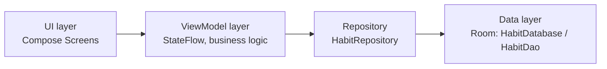

# HabbitTracker
Трекер привычек. Учебный проект
<div align="center">

# CoinHabit

**Геймифицированный трекер привычек с финансовой мотивацией**


</div>

<br>

## О проекте

CoinHabit — трекер привычек с уникальным финансовым механизмом. Отказ от вредной привычки (сигареты, энергетики, вейп) конвертируется в реально сэкономленные деньги, которые накапливаются на конкретную цель пользователя — например, «коплю на iPhone — 60 000 ₽». Параллельно выполнение полезных действий приносит опыт (XP) и монеты для повышения уровня.

Все привычки делятся на два типа:

| Тип | Эффект |
|---|---|
| `BAD_HABIT` | Сохраняет деньги + начисляет XP |
| `GOOD_HABIT` | Начисляет XP |

Проект решает проблему низкой мотивации при отказе от вредных привычек, делая прогресс осязаемым и выраженным в деньгах, а не в абстрактных днях без срыва.

---

## Стек технологий

| Категория | Технология |
|---|---|
| Язык | Kotlin |
| UI | Jetpack Compose |
| Архитектура | MVVM + Clean Architecture |
| База данных | Room (KSP) |
| Асинхронность | Coroutines, StateFlow |
| Навигация | Jetpack Navigation Compose |
| Дизайн | Figma, Photoshop |

Базовый опыт разработки на Dart/Flutter упростил переход на декларативный подход в Compose.

---

## Архитектура

Код разделён на три независимых слоя:

```
data/         — база данных, репозитории, модели
viewmodel/    — бизнес-логика, состояние экранов
ui/           — экраны, компоненты, темы
```



Зависимости между слоями внедряются через кастомную фабрику `HabitViewModelFactory`, репозиторий `HabitRepository` инкапсулирует доступ к базе данных и полностью скрывает её от UI.

---

## Реализовано

**Хранение данных**

- Локальная база данных Room (`HabitDatabase`) с DAO-интерфейсом `HabitDao`: CRUD-операции и агрегирующие SQL-запросы (например, подсчёт всех сэкономленных средств)
- Слой `HabitRepository`, инкапсулирующий работу с базой и скрывающий её от UI
- Dependency Injection через кастомную фабрику `HabitViewModelFactory`

**Онбординг**

- Общая (shared) ViewModel для передачи состояния между экранами без преждевременной записи в базу
- Экран выбора привычек из пресетов (`HabitPresets`), выбор хранится в реактивном `Set` во ViewModel
- Экран конфигурации трат: для каждой вредной привычки пользователь указывает сумму ежедневных расходов
- Финальная трансформация выбранных ID и сумм в сущности `Habit` с сохранением в базу данных

**Главный экран**

- Динамическая статистика: сумма накоплений, текущий уровень, монеты, непрерывный стрик — данные реактивно обновляются через `collectAsState()`
- `LazyColumn` для списка активных привычек пользователя
- Переиспользуемые stateless-компоненты для карточек привычек, статистики и прогресса

---

## Roadmap

- [ ] Привязка сброса суток, стриков и начисления денег к реальному системному времени (DataStore / SharedPreferences) вместо ручного управления днём
- [ ] Полноценный CRUD на UI — редактирование и удаление привычек прямо с главного экрана
- [ ] Динамический прогресс-бар, связанный с реальными целями пользователя
- [ ] Экран «Магазин» с трофеями и раздел «Банк» с графиками накоплений по категориям
- [ ] Встроенные таймеры для полезных привычек (например, «читать не меньше 20 минут»)
- [ ] Синхронизация с сервером через Retrofit

---

<div align="center">

Разработано с использованием Kotlin, Jetpack Compose и Room

</div>
